# Ionic 开发环境搭建

## 1.ionic 是啥
ionic 是一个开源的Hibird App 开发框架，通过它就可以直接使用html、css和javascript编写跨平台的移动app了，目前支持 android、ios、windows phone。 
ionic 在底层使用了 Cordova 进行构建，通过Cordova js代码可以与原生代码(Android 的 java，iOS 的 Objective-C 等)互相通信，并且通过Cordova提供了很多插件来让js访问原生的设备功能，如摄像头、麦克风等。
[ionic 官网](http://ionicframework.com)

## 2.android 环境搭建
android 开发环境是在windows上搭建的
ionic需要使用node.js的包管理器npm进行安装，所以先安装下node.js。
### 安装node.js
在node.js官网上 `https://nodejs.org/` 下载最新版本的node.js。
安装完后输入` node -v ` 查看是否安装成功 。
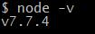
如果安装过旧版本的node.js，直接在官网上下载最新版的安装到相同目录即可。

#### 安装cnpm
因为npm的源在国外，所以速度非常慢，经常会因为网络原因导致安装失败。没有代理的同学可以安装taobao提供的`cnpm`，速度快很多。
>  npm install -g cnpm --registry=https://registry.npm.taobao.org

安装成功后，把命令里的 `npm` 换成 `cnpm` 即可。

### 安装ionic
打开`CMD`控制台时记得右键选使用`管理员模式`。
> npm install -g ioinc

安装完之后输入 `ionic -v` 查看ionic 版本。
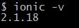

输入 `ionic info` 可以查看ionic信息。
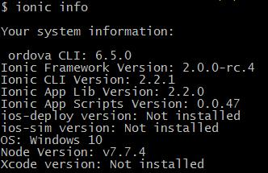

#### 安装Cordova
> npm install -g cordova

输入 `cordova -v` 查看是否安装成功。

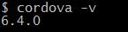

#### 第一个APP
ionic自带了很多demo，先下载一个看看。
> ionic start cutePuppyPics --v2

##### 启动
漫长的等待之后终于安装成功了，切换到项目目录，然后启动服务，服务成功启动后ionic会自动在浏览器打开页面。
> cd cutePuppyPics/
> ionic serve

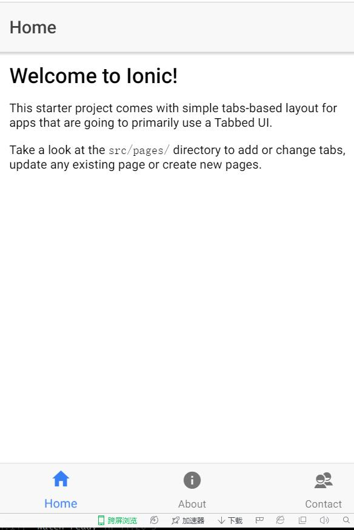

### 安装 JAVA和ANDROID SDK
现在还只能在浏览器中预览，要把demo编译成手机能安装的APP还需要再安装JAVA和ANDROID SDK。
#### 安装JAVA
1. 根据操作系统版本在  [java官网](http://www.oracle.com/technetwork/java/javase/downloads/index.html "JAVA官网") 下载sdk。
2. 在系统->环境变量 中新建 `JAVA_HOME` ，然后把 `%JAVA_HOME%` 添加到 `path` 中。
3. 在命令行输入 ` java -v` 查看是否安装成功。

#### 安装 android studio
1. 下载包含Android Sdk的版本，[Android Studio](http://www.android-studio.org/ "Android Studio")。
2. 在系统->环境变量 中新建 `ANDROID_HOME` ，然后把 `%ANDROID_HOME%`，`%ANDROID_HOME%\platform-tools`  添加到 `path` 中。
3. 在命令行中输入 `adb` 查看 `Android Sdk` 是否安装成功。
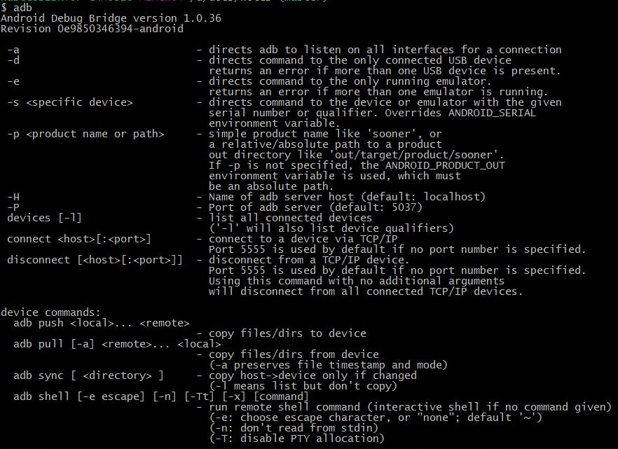
4. 打开 Android Studio 在 Tools -> Android -> Android Virtual Device Manager 新建一个模拟器。
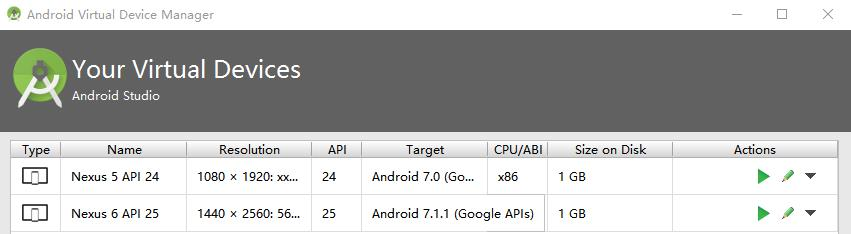

#### 编译、启动模拟器
先在ionic中添加android平台文件。
>ionic platform add android 

然后开始编译
>  ionic build android  

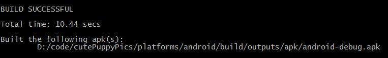

编译完之后apk生成在项目目录下 `\platforms\android\build\outputs\apk\` 下。

大功告成！在模拟器中运行下试试。
> ionic emulate android  

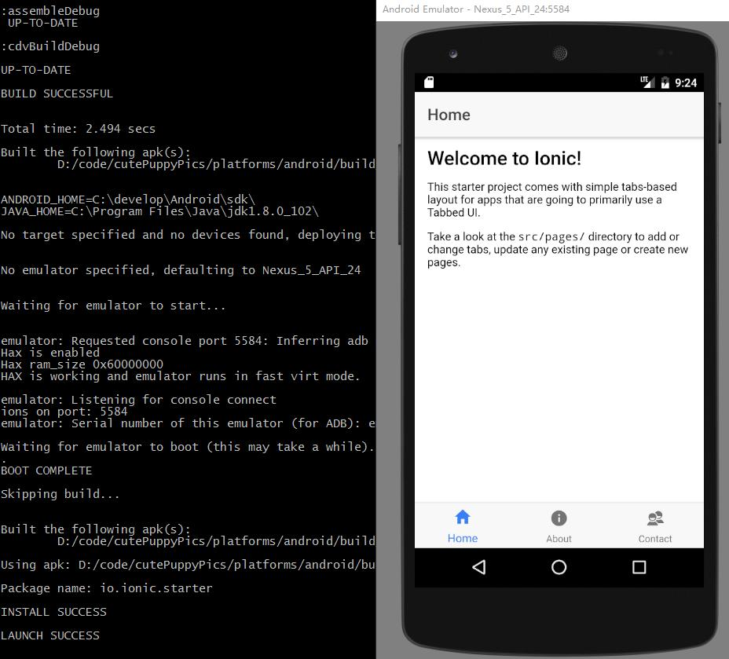

霍霍，做个手机app还是蛮简单的嘛~

输入run也可以直接编译加运行
>ionic run android  

## 3.ios 开发环境搭建
虽然ionic是跨平台的框架，但是苹果限制了IOS APP只能在Mac OS上开发，所以要开发ios app你还得有个Mac 电脑，用虚拟机的话至少要i7+16GB内存+SSD的电脑，不然还是算了吧，实在是太卡了。

虚拟机安装OS X可以参考 [Windows下 VM12虚拟机安装OS X 10.11(详细教程)](http://bbs.feng.com/forum.php?mod=viewthread&tid=10620016)， [ 黑苹果的初安装与升级 VMware12+mac os x 10.9+升级+VMware Tools安装](http://blog.csdn.net/u010720408/article/details/50944840)。

OS X 最好下载最新版本的，不然安装 xcode 的时候还需要先升级操作系统，又是漫长的等待。。。
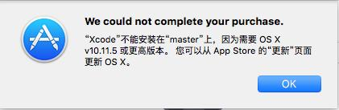

### node.js 、ionic 安装
步骤跟windows上装一样，记得命令前加上 `sudo` 就行。

### 安装xcode
在app store 中搜索 `xcode` ，点击安装。
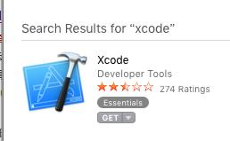
### 第一个IOS APP
下载 demo
> ionic start cutePuppyPics --v2

运行起来
> ionic serve

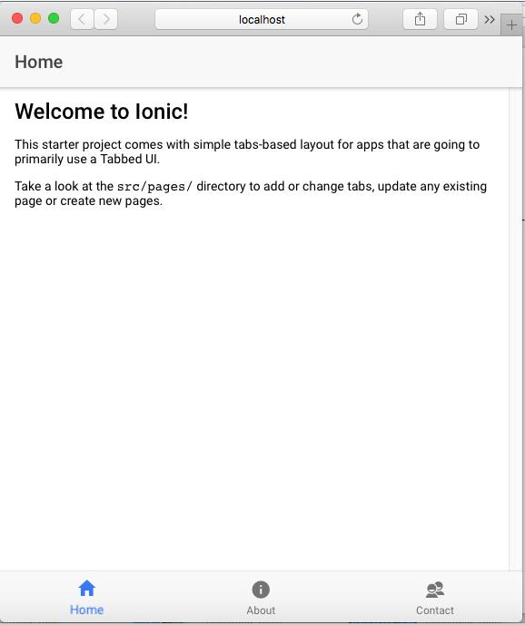

界面和之前在windows上运行时一模一样，在url后面加上 `/?ionicplatform=ios#` 之后再预览下，发现tab上的图标变成ios风格的了。用ionic不光是程序能跨平台，图标也帮你跨平台了。
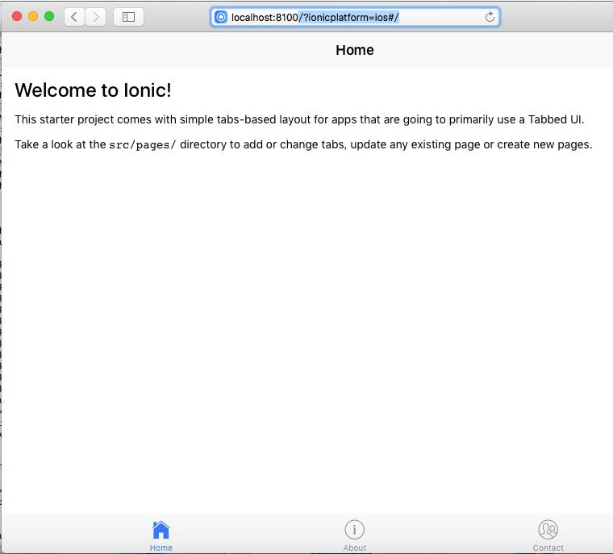

ionic框架自带了很多常用的图标 [ionic icon](http://ionicons.com/)，在程序里根据id可以直接，使用非常方便。
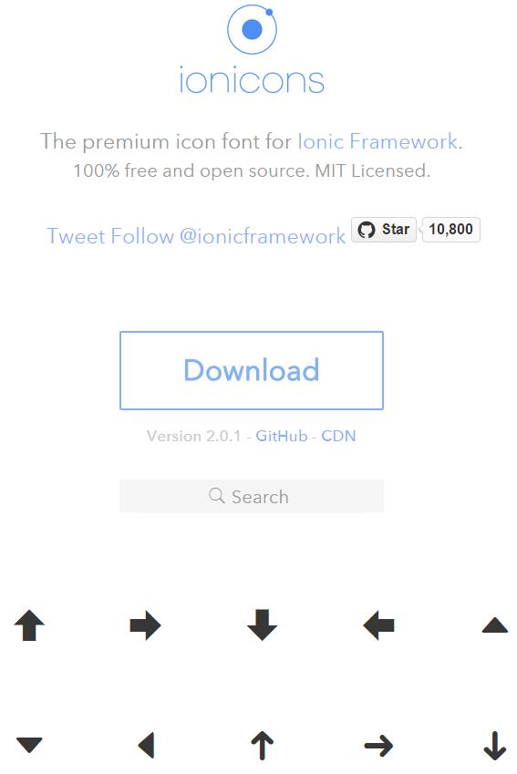

### 把demo编译成app

####  在ionic中添加ios 开发平台
> ionic platform add ios

#### 安装ios模拟器
> sudo cnpm install -g ios-sim

#### 编译 APP
> ionic build ios

编译好的app在 `/platforms/ios/build/emulator` 下面
#### 在模拟器中预览下
> ionic emulate ios 

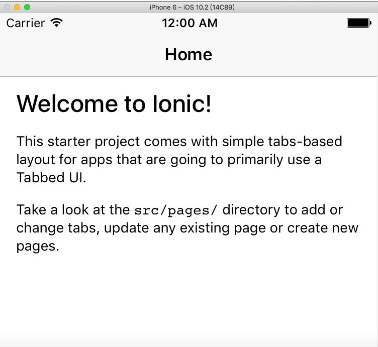

编译好的app在 `项目目录/platforms/ios/build/emulator` 下面，用 `ios-sim lanuch` 命令加 `--devicetypeid` 参数还可以直接指定要模拟的设备。
> ios-sim lanuch XXX.app --devicetypeid com.apple.CoreSimulator.SimDeviceType.iPhone-6

查看模拟器支持的设备
> ios-sim showdevicetypes
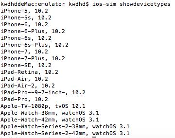
 
 

### 公众号
个人公众号:runningCode

